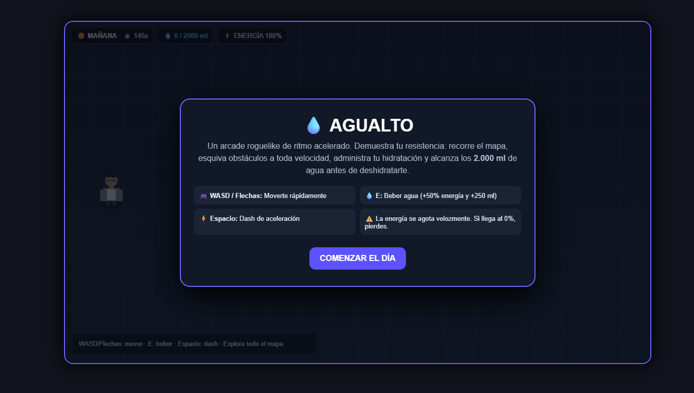
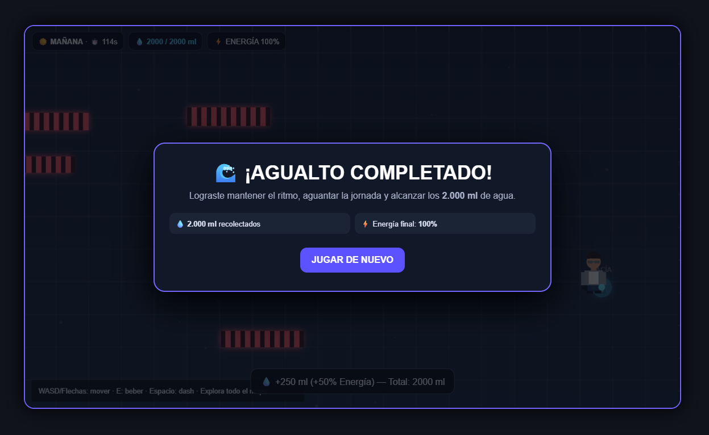
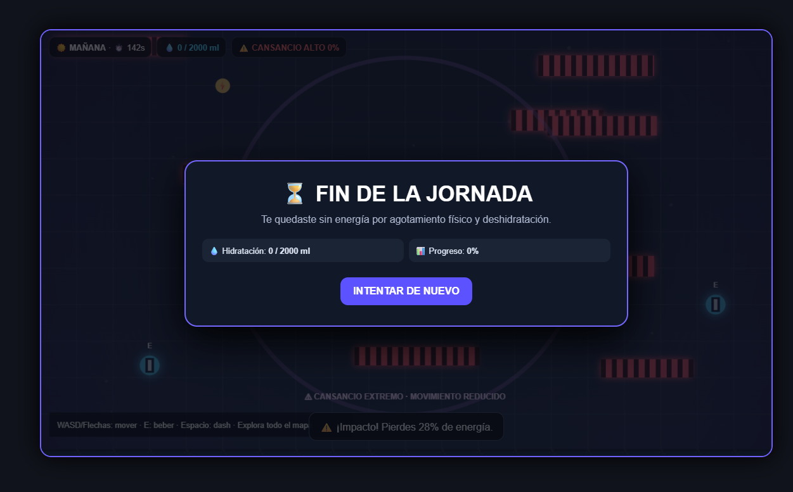

# 💧 Agualto

  

<h1 align="center">💧 AGUALTO</h1>

  <strong>¡Muévete rápido. Administra tu energía. Mantente hidratado!</strong>

  ⚡ <strong>Arcade</strong> · 💧 <strong>Roguelike</strong> · 🏃 <strong>Supervivencia</strong>

---

## 💧 ¿De qué trata?

**Agualto** es un **arcade roguelike de ritmo acelerado** donde el jugador debe recorrer un mapa lleno de obstáculos mientras administra constantemente su energía e hidratación.

El objetivo es conseguir:

# 💧 2.000 ml

antes de que la energía del jugador llegue a cero.

---

## 🎯 Objetivo

El jugador debe:

* 🗺️ Recorrer el mapa.
* ⚠️ Esquivar obstáculos.
* 💧 Beber agua.
* ⚡ Administrar la energía.
* 🏁 Alcanzar los **2.000 ml de agua**.

La dificultad está en mantener un equilibrio entre velocidad, movimiento e hidratación.

---

## ⚙️ Mecánicas principales

### 💧 Beber agua

Presiona:

**E**

El jugador consume agua y obtiene:

> 💧 **+250 ml**
> ⚡ **+50% de energía**

---

### ⚡ Dash

Presiona:

**SPACE**

El personaje realiza un dash para desplazarse rápidamente.

Pero existe un riesgo:

> ⚠️ El dash consume energía mucho más rápido.

---

## 🧠 Sistema de energía

La energía es uno de los elementos principales del juego.

Cuando la energía baja hasta **10% o menos**, el jugador comienza a moverse más lentamente.

Si llega a:

# ⚠️ 0%

la partida termina.

---

## 🕹️ Controles

| Acción     | Control        |
| ---------- | -------------- |
| Moverse    | WASD / Flechas |
| Beber agua | E              |
| Dash       | SPACE          |

---

## 📸 Gameplay

  

---

## 🏆 Victoria

El jugador gana cuando consigue:

# 💧 2.000 ml

antes de quedarse sin energía.

  

---

## 💀 Derrota

La partida termina cuando la energía llega al **0%**.

  

---

## 🎭 Género

### 🕹️ Arcade · 🎲 Roguelike · 💀 Survival

La combinación de velocidad, obstáculos, gestión de recursos y condiciones de supervivencia crea una experiencia rápida y exigente.

---

## 🎮 Diseño de la experiencia

Agualto busca transmitir una sensación de:

> ⚡ **Velocidad + presión + supervivencia**

La energía se consume rápidamente, obligando al jugador a tomar decisiones constantemente.

---

## ▶️ Jugar

<a href="./index.html">
  <strong>💧 JUGAR AGUALTO</strong>
</a>

---

  💧 <strong>Hidrátate.</strong> ⚡ <strong>Muévete.</strong> 🏃 <strong>Sobrevive.</strong>

