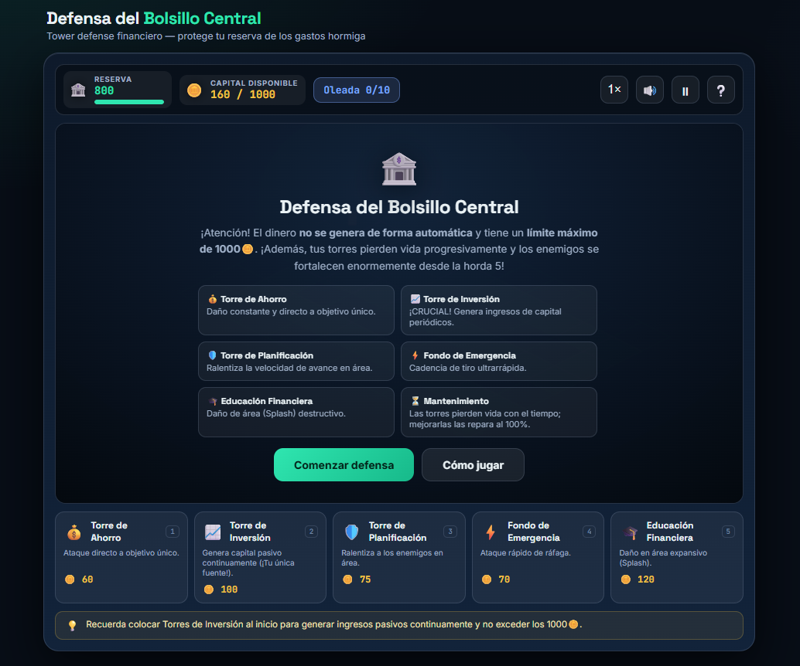
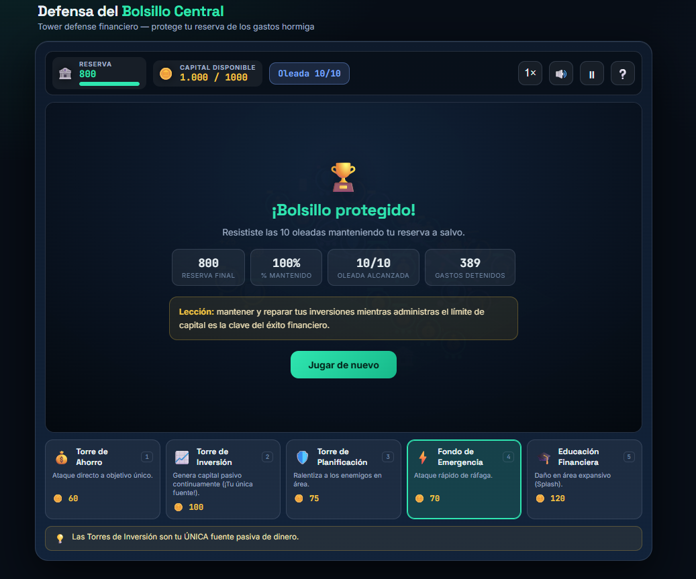
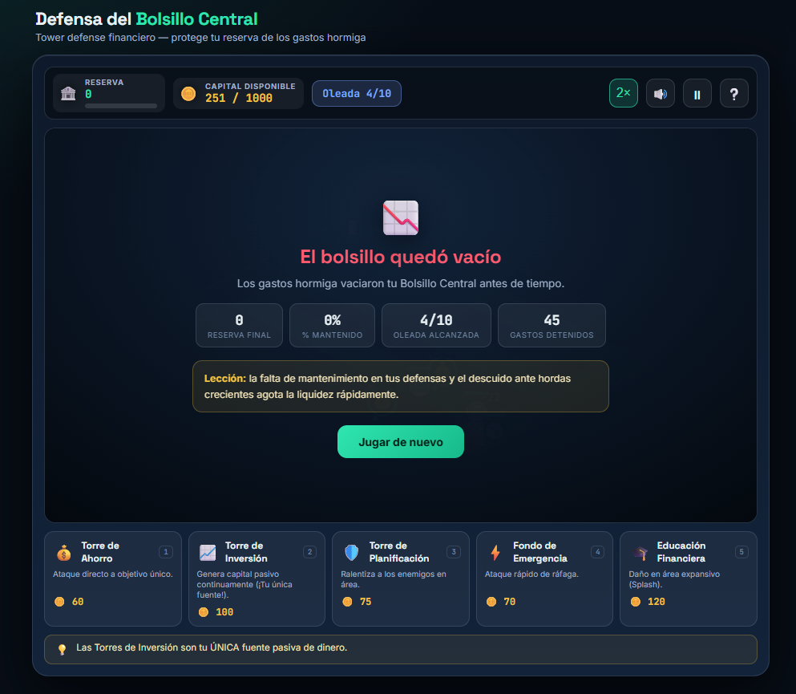

# 💰 Defensa del Bolsillo Central

<p align="center">
  
</p>

<h1 align="center">💰 DEFENSA DEL BOLSILLO CENTRAL</h1>

<p align="center">
  <strong>Tu dinero está bajo ataque. ¿Podrás administrarlo?</strong>
</p>

<p align="center">
  🏰 <strong>Tower Defense</strong> · 💰 <strong>Finanzas</strong> · 🧠 <strong>Estrategia</strong>
</p>

---

## 💰 ¿De qué trata?

**Defensa del Bolsillo Central** es un videojuego **Tower Defense 2D Top-Down** basado en la administración responsable del dinero.

El jugador debe proteger su **Bolsillo Central** de diferentes tipos de gastos destructivos.

Entre los enemigos se encuentran:

* 🪙 Gastos Hormiga
* 🛒 Compras por Impulso
* 🔄 Suscripciones Olvidadas
* 📢 Publicidad Engañosa

Para defenderse, el jugador construye torres relacionadas con la educación financiera.

---

## 🎯 Objetivo

El objetivo es sobrevivir a las oleadas de enemigos y proteger el dinero acumulado.

El jugador comienza con:

# 💰 160 monedas

Debe utilizar ese presupuesto de manera estratégica para construir y mejorar sus defensas.

---

## ⚙️ Mecánica principal

La mecánica principal consiste en:

> **Construir → Invertir → Defender → Administrar**

El jugador debe colocar torres en el mapa utilizando el dinero disponible.

La **Torre de Inversión** es especialmente importante porque genera capital pasivo continuamente.

---

## 🏰 Torres

### 💰 Torre de Ahorro

Realiza ataques directos contra un único objetivo.

### 📈 Torre de Inversión

Genera capital pasivo continuamente.

> 💡 Es la única fuente de generación de dinero.

### 📋 Torre de Planificación

Ralentiza a los enemigos dentro de un área.

### ⚡ Fondo de Emergencia

Realiza ataques rápidos en ráfaga.

### 🎓 Educación Financiera

Realiza daño en área mediante ataques expansivos.

---

## 🧠 Administración de recursos

Las torres tienen una vida útil que se va agotando automáticamente.

Por eso el jugador debe decidir cuidadosamente cómo utilizar sus recursos.

```text
💰 DINERO
   ↓
🏰 CONSTRUIR TORRES
   ↓
⚔️ DERROTAR GASTOS
   ↓
📈 GENERAR MÁS CAPITAL
   ↓
🏰 MEJORAR DEFENSAS
```

Una mala administración puede provocar que el jugador se quede sin recursos.

---

## 👾 Enemigos

Las hordas representan diferentes problemas financieros.

| Enemigo                    | Representa                                 |
| -------------------------- | ------------------------------------------ |
| 🪙 Gastos Hormiga          | Pequeños gastos frecuentes                 |
| 🛒 Compras por Impulso     | Compras innecesarias                       |
| 🔄 Suscripciones Olvidadas | Pagos que pasan desapercibidos             |
| 📢 Publicidad Engañosa     | Consumo impulsivo provocado por publicidad |

---

## 📈 Progresión

A medida que avanza la partida:

* ⚡ Aumenta la velocidad de las oleadas.
* 👾 Aparecen enemigos más complejos.
* 📈 Aumenta la frecuencia de los ataques.
* 💰 Se vuelve más importante administrar correctamente el presupuesto.

---

## 🕹️ Controles

| Acción                       | Control   |
| ---------------------------- | --------- |
| Seleccionar / colocar torres | 🖱️ CLICK |
| Interacción                  | 🖱️ MOUSE |

La estrategia y la colocación de las torres son el centro de la jugabilidad.

---

## 📸 Gameplay

<p align="center">
  
</p>

---

## 🏆 Victoria

El jugador debe resistir las oleadas completas manteniendo al menos el **50% del capital inicial** en el Bolsillo Central.

<p align="center">
  
</p>

---

## 💀 Derrota

El jugador pierde cuando el dinero del Bolsillo Central llega a:

# 💸 $0

antes de completar las oleadas necesarias.

<p align="center">
  
</p>

---

## 🎭 Género

### 🏰 Strategy · Tower Defense 2D · Educational

El género estratégico permite representar de forma visual cómo diferentes decisiones financieras pueden afectar los recursos disponibles.

---

## 💡 ¿Qué enseña?

El juego muestra de manera gráfica cómo los **gastos pequeños y frecuentes** pueden agotar un presupuesto cuando no existen mecanismos de:

* 💰 Ahorro
* 📋 Planificación
* 📈 Inversión
* 🛡️ Fondo de emergencia
* 🎓 Educación financiera

El jugador aprende mediante la relación entre **decisiones financieras y consecuencias**.

> 💡 **Proteger tu dinero también requiere estrategia.**

---

## 🎨 Estilo visual

El juego utiliza una estética:

* 🟩 Minimalista
* 🔵 Moderna
* ⚪ Limpia
* 📐 Isométrica

Con predominancia de tonos verdes, azules y grises.

---

## 👥 Público objetivo

El juego está dirigido principalmente a:

> **Jóvenes de 18 a 25 años**

Busca presentar conceptos financieros básicos mediante una experiencia de estrategia fácil de comprender.

---

## ▶️ Jugar

<p align="center">

<a href="./index.html">
  <strong>💰 JUGAR DEFENSA DEL BOLSILLO CENTRAL</strong>
</a>

</p>

---

<p align="center">
  💰 <strong>Administra.</strong> 🛡️ <strong>Defiende.</strong> 📈 <strong>Invierte.</strong>
</p>
