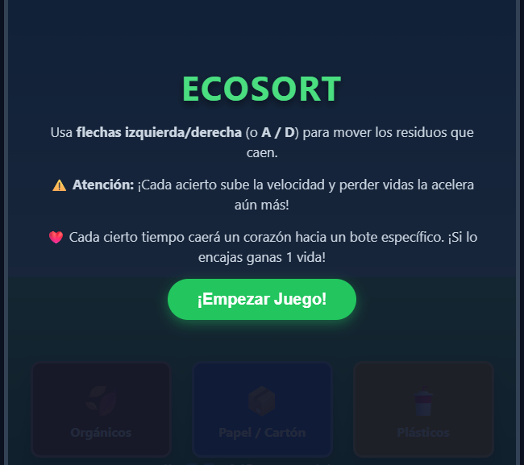
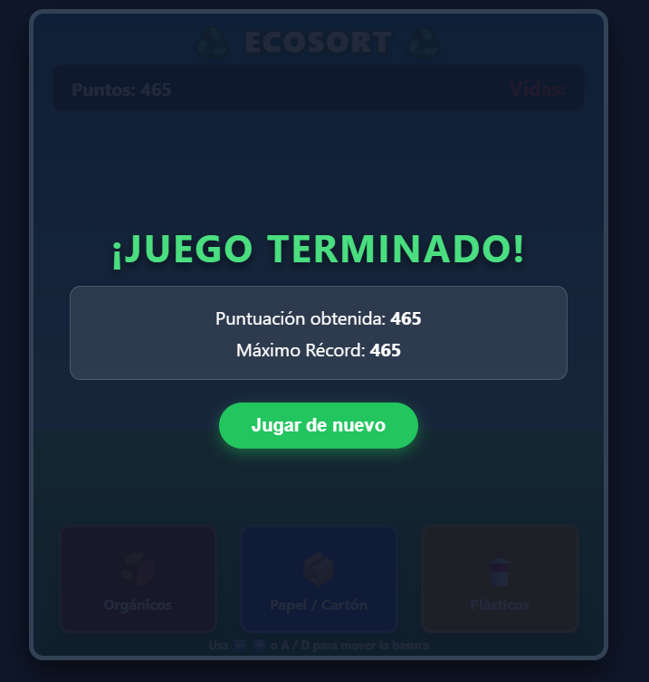

# ♻️ EcoSort

<p align="center">
  
</p>

<h1 align="center">♻️ ECOSORT</h1>

<p align="center">
  <strong>¡Clasifica correctamente y ayuda al planeta!</strong>
</p>

<p align="center">
  🌱 <strong>2D Arcade</strong> · ♻️ <strong>Reciclaje</strong> · ⚡ <strong>Reflejos</strong>
</p>

---

## 🌎 ¿De qué trata?

**EcoSort** es un videojuego arcade en 2D enfocado en el **cuidado del medio ambiente y el reciclaje**.

Los residuos aparecen desde la parte superior de la pantalla y caen mientras el jugador debe moverlos hacia el contenedor correspondiente.

Existen **3 tipos de contenedores**:

* 🟢 Orgánicos
* 📦 Papel / Cartón
* 🧴 Plásticos

---

## 🎯 Objetivo

El objetivo es **clasificar la mayor cantidad posible de residuos correctamente**.

Cada residuo debe llegar al contenedor que corresponde antes de tocar el suelo.

Pero cuidado...

> ⚠️ **¡Cada error cuesta una vida!**

El jugador comienza con **3 vidas**.

---

## ⚙️ Mecánica principal

El residuo cae constantemente y el jugador debe moverlo horizontalmente hasta colocarlo sobre el contenedor correcto.

```text
          🧴
          ↓
     RESIDUO
          ↓
   ←────────────→
     
 🟢        📦        🧴
Orgánico   Papel    Plástico
```

Cada clasificación correcta aumenta la dificultad porque la **velocidad de caída aumenta**.

Además, perder vidas hace que el juego sea todavía más rápido.

---

## ❤️ Vidas y dificultad

El jugador comienza con:

### ❤️ ❤️ ❤️

Cada clasificación incorrecta:

**❌ → -1 vida**

Cuando las vidas llegan a:

### 💀 0

La partida termina.

---

## 💚 Corazones especiales

Durante la partida aparecen ocasionalmente **corazones especiales**.

El corazón debe colocarse en el bote específico indicado.

Si el jugador consigue encajarlo correctamente:

> ❤️ **+1 vida**

Esto permite recuperar una vida perdida y continuar jugando.

---

## 🕹️ Controles

| Acción          | Control |
| --------------- | ------- |
| Mover izquierda | ⬅️ / A  |
| Mover derecha   | ➡️ / D  |

El jugador puede utilizar tanto las **teclas A/D** como las **flechas izquierda/derecha**.

---

## 📸 Gameplay

<p align="center">
  
</p>

---

## 💀 Game Over

Cuando el jugador pierde sus 3 vidas, la partida termina.

En la pantalla final podrá consultar su **puntuación / récord obtenido**.

<p align="center">
  
</p>

---

## 🎭 Género

### 🕹️ Arcade · 🌱 Educational

EcoSort utiliza una jugabilidad rápida y sencilla propia de los juegos arcade, mientras introduce conceptos relacionados con la **clasificación de residuos y el reciclaje**.

---

## ▶️ Jugar

<p align="center">

<a href="https://ivoismael.github.io/GameDevelopmentPortafolio/EcoSort/">
  <strong>♻️ JUGAR ECOSORT</strong>
</a>

</p>

---

## 🌱 Propósito

EcoSort busca enseñar de una manera sencilla que **cada tipo de residuo tiene un lugar adecuado**.

El jugador aprende mediante la repetición y la interacción:

> ♻️ **Clasificar correctamente = cuidar el planeta.**

---

<p align="center">
  🌎 <strong>Clasifica.</strong> ♻️ <strong>Recicla.</strong> 🌱 <strong>Cuida el planeta.</strong>
</p>
