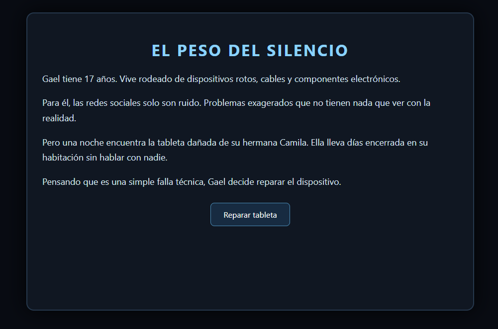
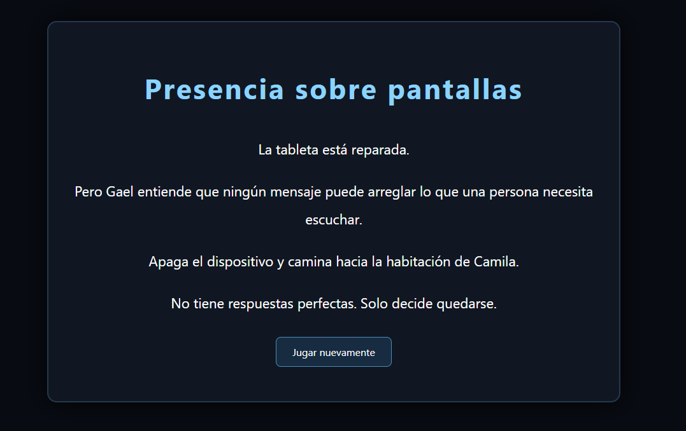

# 📱 El peso del silencio

  

<h1 align="center">📱 EL PESO DEL SILENCIO</h1>

  <strong>Algunas heridas no dejan marcas visibles.</strong>

  🧩 <strong>Puzzle</strong> · 📖 <strong>Narrativa</strong> · 💬 <strong>Ciberbullying</strong>

---

## 📖 ¿De qué trata?

**El peso del silencio** es un videojuego narrativo de **puzles** que aborda el problema del **ciberbullying**.

El jugador controla a **Gael**, un joven de 17 años que inicialmente considera los problemas digitales de otras personas como simples "dramas adolescentes".

Todo cambia cuando su hermana menor, **Camila**, deja repentinamente de hablar y se encierra en su habitación.

Al intentar reparar la tableta de su hermana, Gael descubre una serie de mensajes, comentarios, publicaciones y notas de voz que revelan una campaña sistemática de humillación.

---

## 👤 Gael

### Al inicio

Gael es:

* Observador.
* Pragmático.
* Aficionado a reparar teléfonos viejos.
* Poco interesado en las redes sociales.
* Indiferente ante los problemas digitales de otras personas.

Para él, estos problemas son asuntos ajenos.

---

## 🔎 La investigación

Para reparar la tableta, Gael debe reconstruir lo ocurrido utilizando diferentes elementos digitales:

💬 Chats
📱 Publicaciones
🗑️ Historias borradas
🎙️ Notas de voz
🧩 Piezas de información

El jugador debe ordenar las piezas y descubrir progresivamente qué ocurrió.

---

## ⚙️ Mecánica principal

El juego utiliza **puzles narrativos**.

El jugador deberá:

1. 🔎 Analizar la información.
2. 🧩 Ordenar mensajes.
3. 💬 Elegir las opciones correctas.
4. 📖 Reconstruir los acontecimientos.
5. ➡️ Continuar la historia.

Si el jugador falla un puzle:

> ❌ No podrá avanzar hasta resolverlo correctamente.

---

## 🕹️ Controles

| Acción               | Control   |
| -------------------- | --------- |
| Seleccionar opciones | 🖱️ CLICK |

No existen controles de movimiento.

La experiencia está centrada completamente en la **investigación y resolución de puzles**.

---

## 📖 Tipo de narrativa

### 🔗 Narrativa lineal

Se utiliza una narrativa lineal porque la historia necesita seguir un **orden cronológico**.

El jugador descubre gradualmente cómo fue aumentando el acoso y comprende el impacto emocional de lo ocurrido.

---

## 🧠 Evolución del personaje

### 👦 Inicio

Gael piensa que los problemas digitales son exageraciones.

⬇️

### 🔎 Investigación

Comienza a descubrir las pruebas del acoso.

⬇️

### 🧩 Comprensión

Entiende el daño que puede provocar el acoso virtual.

⬇️

### ❤️ Final

Gael deja de lado la indiferencia y decide acompañar a su hermana.

No busca venganza.

En cambio, apaga los dispositivos, entra a la habitación de Camila y se sienta junto a ella para escucharla.

> **La presencia y la contención en el mundo real son el primer paso para enfrentar el daño digital.**

---

## 📸 Gameplay

  

---

## 🏁 Final

Una vez que el jugador completa todos los puzles, llega al final de la historia y recibe un **mensaje de reflexión**.

  

---

## 🎭 Género

### 🧩 Puzzle · 📖 Adventure · 🎭 Narrative

La experiencia se centra en resolver puzles para avanzar en una historia corta con una temática social.

---

## 🎯 Propósito

El juego busca generar reflexión sobre el **ciberbullying** y mostrar que detrás de una pantalla puede existir una persona enfrentando una situación real.

Su objetivo no es enseñar mediante estadísticas, sino mediante una **historia interactiva**.

---

## ▶️ Jugar

<a href="https://ivoismael.github.io/GameDevelopmentPortafolio/ElPesoDelSilencio/">
  <strong>📱 JUGAR EL PESO DEL SILENCIO</strong>
</a>

---

  <strong>Escuchar también es una forma de ayudar.</strong>

