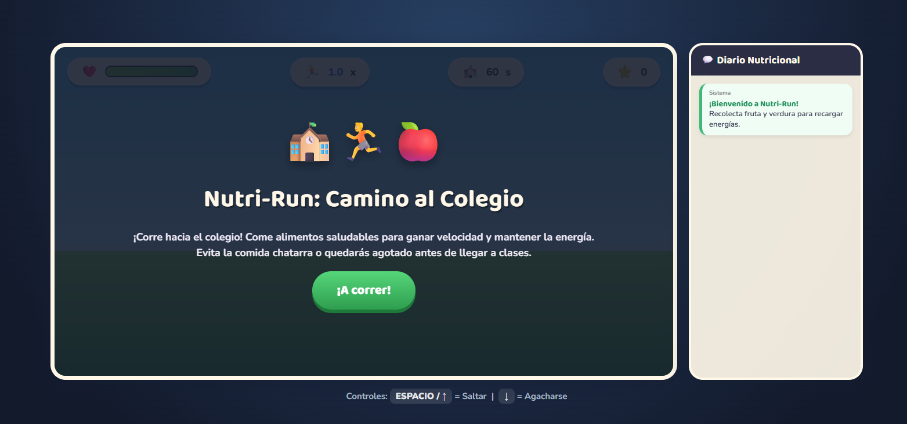
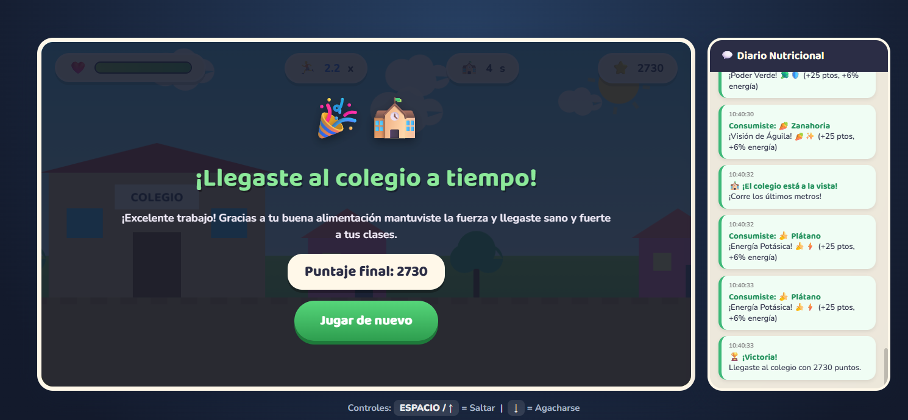
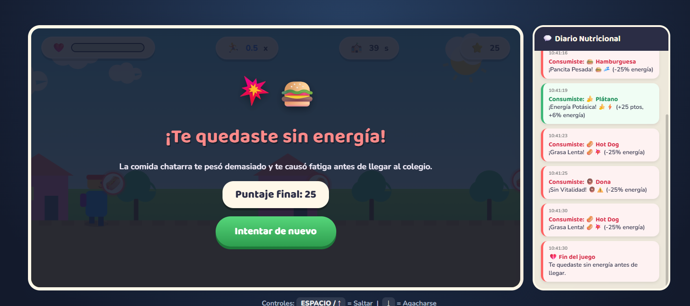

# 🥗 Nutri-Run

<p align="center">
  
</p>

<h1 align="center">🥗 NUTRI-RUN</h1>

<p align="center">
  <strong>¡Corre, elige bien y llega hasta la meta!</strong>
</p>

<p align="center">
  🏃 <strong>Endless Runner 2D</strong> · 🍎 <strong>Alimentación saludable</strong> · ⚡ <strong>Arcade</strong>
</p>

---

## 🥗 ¿De qué trata?

**Nutri-Run** es un videojuego **Arcade / Endless Runner 2D** enfocado en enseñar a los niños la importancia de elegir alimentos saludables.

El jugador debe avanzar por un recorrido mientras aparecen diferentes alimentos.

Algunos ayudan a mantener la energía, mientras que otros pueden perjudicar al jugador.

---

## 🎯 Objetivo

El objetivo es **llegar al final del recorrido** manteniendo la barra de energía en el nivel requerido.

Durante el recorrido el jugador deberá:

* 🍎 Atrapar alimentos saludables.
* 💧 Recoger agua.
* 🍔 Evitar comida chatarra.
* ⚡ Mantener su energía.
* 🏁 Llegar a la meta.

---

## ⚙️ Mecánica principal

La mecánica combina:

**🏃 Correr + 🦘 Saltar + ↕️ Agacharse / cambiar de carril**

El jugador debe observar los elementos que se aproximan y reaccionar rápidamente.

```text
🍎 Comida saludable
       ↓
    🦘 SALTAR
       ↓
   ⚡ BENEFICIO

🍔 Comida chatarra
       ↓
   🚫 ESQUIVAR
       ↓
   ❤️ PÉRDIDA
```

---

## 🕹️ Controles

| Acción                        | Control    |
| ----------------------------- | ---------- |
| Saltar                        | ⬆️ / SPACE |
| Agacharse / cambiar de carril | ⬇️         |
| Movimiento                    | Automático |

El personaje avanza automáticamente, por lo que el jugador debe concentrarse en **saltar, esquivar y tomar decisiones rápidas**.

---

## 🍎 ¿Cómo enseña a elegir alimentos saludables?

El juego relaciona directamente los alimentos con el estado del personaje.

### 🟢 Alimentos saludables

🍎 Frutas
💧 Agua

➡️ Ayudan al jugador y representan elecciones positivas.

### 🔴 Comida ultraprocesada

🍔 Comida chatarra

➡️ Puede frenar al personaje o reducir su energía.

De esta manera, el jugador aprende mediante una relación directa entre **elección → consecuencia**.

---

## ⚡ Energía

La barra de energía representa el estado del personaje.

El jugador debe conservar suficiente energía hasta alcanzar la meta.

Si la energía llega a **0**, el jugador pierde.

---

## 🏆 Victoria

El jugador gana cuando:

> 🏁 **Llega al final del recorrido con la energía necesaria.**

<p align="center">
  
</p>

---

## 💀 Derrota

El jugador pierde cuando su barra de energía se agota antes de alcanzar la meta.

<p align="center">
  
</p>

---

## 📸 Gameplay

<p align="center">
  
</p>

---

## 🎭 Género

### 🏃 Arcade · Endless Runner 2D

Este género es adecuado para niños porque utiliza controles sencillos e intuitivos. El jugador comprende rápidamente el objetivo sin necesitar un tutorial extenso.

---

## 🎨 Experiencia buscada

El juego busca transmitir:

> 🌈 **Entusiasmo · Dinamismo · Reto**

La estética colorida y la velocidad del juego están pensadas para mantener la atención activa del jugador.

---

## ▶️ Jugar

<p align="center">

<a href="https://ivoismael.github.io/GameDevelopmentPortafolio/Nutri-Run/">
  <strong>🥗 JUGAR NUTRI-RUN</strong>
</a>

</p>

---

<p align="center">
  🍎 <strong>Come bien.</strong> 💧 <strong>Hidrátate.</strong> 🏃 <strong>Sigue corriendo.</strong>
</p>
