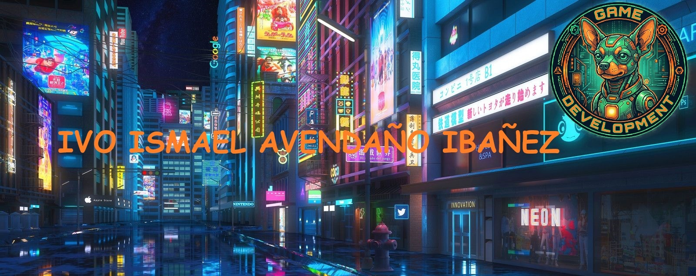
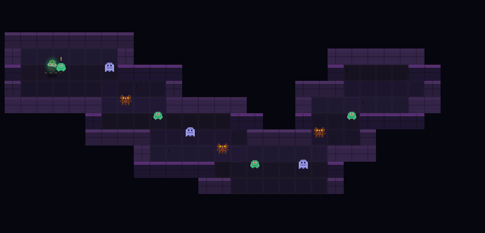
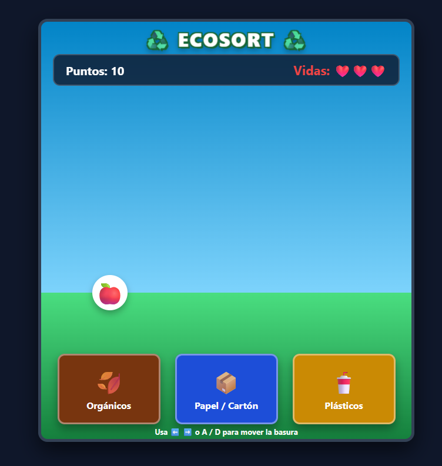
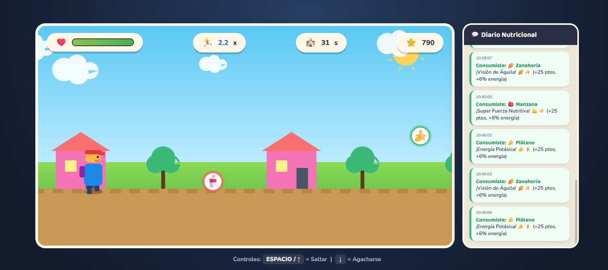
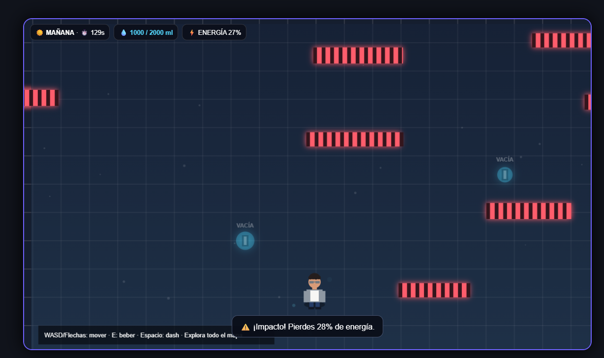
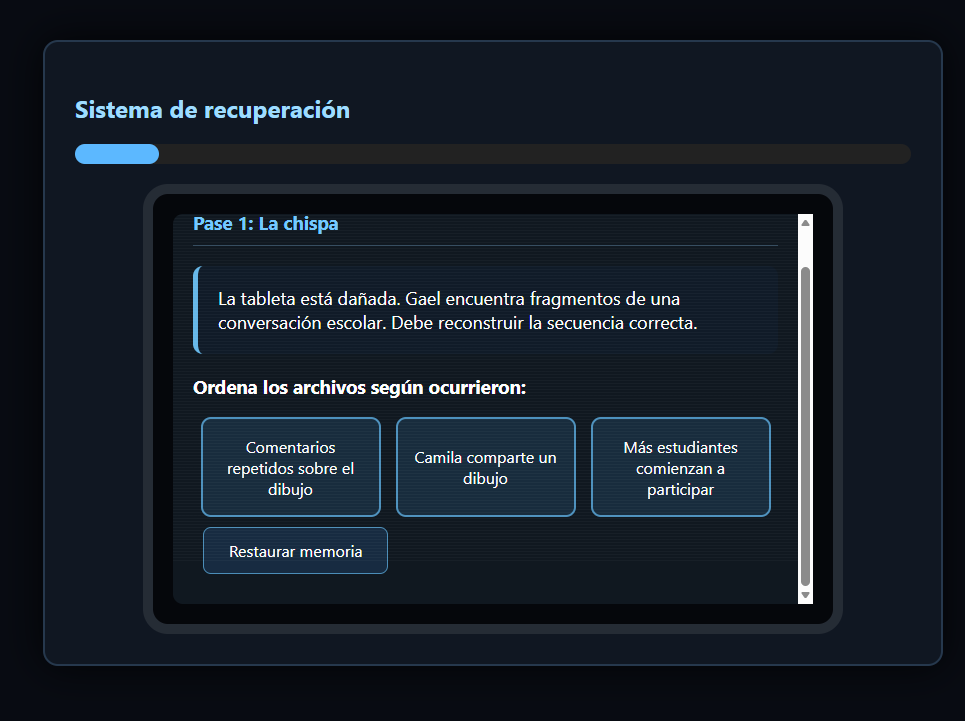
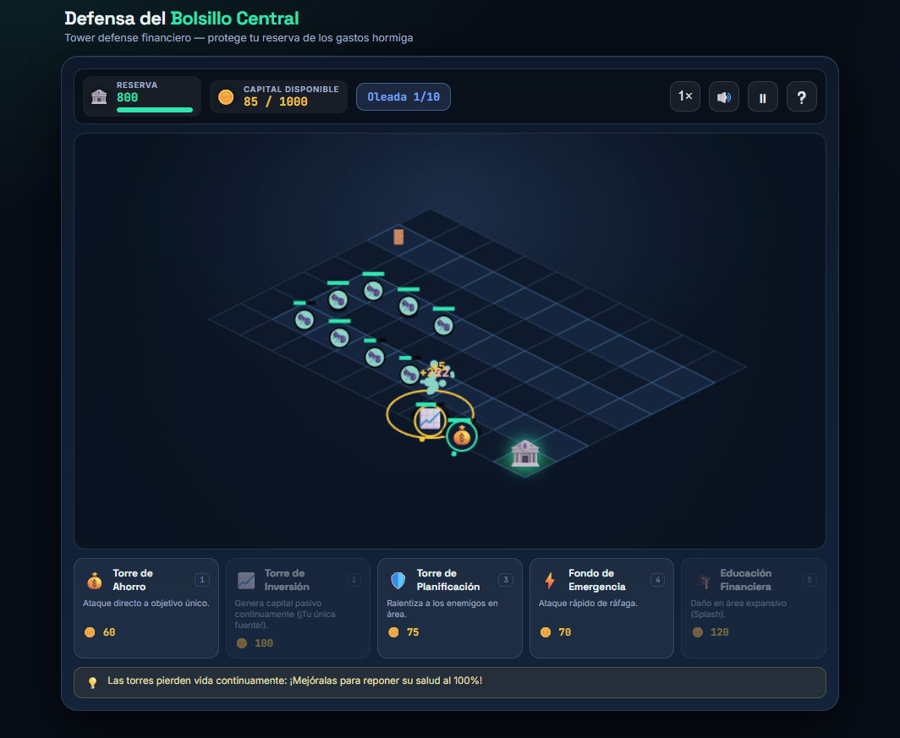

<p align="center">
  
</p>


<p align="center">
  
  
  
</p>

---

## 👋 Sobre mí

Hola :) Soy **Ivo Ismael Avendaño Ibañez**, tengo **19 años** y actualmente curso el **4to semestre de Ingeniería en Sistemas**.


Para mí, un buen videojuego debe tener **alma**, una identidad propia y un trasfondo que haga que el jugador quiera descubrir más.

---

## 🎮 Mis intereses en videojuegos

Mis géneros favoritos son:

* 🧙 **RPG**
* ⚔️ **CRPG**
* 👻 **Terror**
* 🌌 **Ciencia ficción**
* 🌃 **Cyberpunk**

Me gustan especialmente los juegos que tienen **mundos interesantes, historias profundas, personajes memorables y temas que invitan a reflexionar**.

---

## 💡 Mi forma de desarrollar videojuegos

Una de las cosas que más me interesa al desarrollar videojuegos es que estos puedan ir más allá del entretenimiento.

En la materia de **Game Development**, los proyectos que desarrollo suelen tener como base **problemas sociales o situaciones de la vida real**.

Algunos de los temas que he trabajado incluyen:

| 🎮 Proyecto / Tema        | 🌎 Problemática                  |
| ------------------------- | -------------------------------- |
| 💬 Ciberbullying          | Acoso y violencia en Internet    |
| 🌱 Contaminación          | Cuidado del medio ambiente       |
| 🧩 Puzles educativos      | Aprendizaje mediante videojuegos |
| 💧 Hidratación            | Importancia del cuidado personal |
| 🥗 Alimentación saludable | Buenos hábitos alimenticios      |

Mi objetivo es crear videojuegos que **diviertan, pero que también puedan dejar un mensaje en el jugador**.

---

## 🕹️ Filosofía

> **"Un videojuego puede ser entretenimiento, pero también puede contar una historia, enseñar algo y generar conciencia."**

Creo que el desarrollo de videojuegos puede utilizarse como una herramienta para representar problemas reales de una manera **interactiva, creativa y entretenida**.

Por eso, intento que cada proyecto tenga una razón detrás de su creación y que no sea simplemente un juego más.

---

## 🚀 Sobre este proyecto

Este repositorio forma parte de mi proceso de aprendizaje en **Game Development** y representa una de las experiencias que estoy desarrollando durante mi formación como estudiante de Ingeniería en Sistemas.

A través de estos proyectos busco mejorar mis habilidades en:

* 🎮 Diseño y desarrollo de videojuegos
* 💻 Programación
* 🧠 Diseño de mecánicas
* 🎨 Diseño de experiencias
* 📖 Narrativa y creación de mundos
* 🌎 Desarrollo de videojuegos con temática social

---

## 👨‍💻 Perfil

```text
Nombre       : Ivo Ismael Avendaño Ibañez
Edad         : 19 años
Carrera      : Ingeniería en Sistemas
Semestre     : 4to semestre
Área         : Game Development
Intereses    : RPG · CRPG · Terror · Ciencia Ficción · Cyberpunk
Enfoque      : Videojuegos con propósito
```

---

---

# 🎮 Mis videojuegos

Durante la materia de **Game Development** desarrollé diferentes videojuegos, cada uno centrado en una problemática, concepto o experiencia diferente.

Los proyectos combinan **programación, diseño de mecánicas, narrativa y temáticas sociales**, buscando que cada videojuego tenga una identidad propia y algo que transmitir.

---

## 🕹️ Proyectos realizados

### 🧟 01 · Zombie-Loop

<p align="center">
  
</p>

> 🧮 **Aprender matemáticas mientras sobrevives a una mazmorra.**

**Zombie-Loop** es un videojuego educativo 2D Pixel Art dirigido a niños que están entrando a la secundaria. El jugador controla a un zombie que avanza automáticamente por una mazmorra y debe enfrentarse a 10 monstruos resolviendo operaciones matemáticas.

| 🎮 Género                        | 🛠️ Tecnología          |
| :------------------------------- | :---------------------- |
| Adventure · Puzzle · Educational | HTML · CSS · JavaScript |

**🎯 Objetivo:** derrotar a los 10 enemigos respondiendo correctamente preguntas de suma, resta, multiplicación y división.

<p align="center">

<a href="./Zombie-Loop/">
  
</a>
<a href="./Zombie-Loop/index.html">
  
</a>

</p>

---

### ♻️ 02 · EcoSort

<p align="center">
  
</p>

> 🌱 **Cada residuo tiene un lugar. ¿Podrás clasificarlo correctamente?**

**EcoSort** es un videojuego arcade 2D sobre el cuidado del medio ambiente. Los residuos caen desde la parte superior de la pantalla y el jugador debe moverlos hacia el contenedor correspondiente.

Los tres tipos de residuos son **orgánicos, papel/cartón y plásticos**.

| 🎮 Género            | 🛠️ Tecnología          |
| :------------------- | :---------------------- |
| Arcade · Educational | HTML · CSS · JavaScript |

**🎯 Objetivo:** conseguir la mayor puntuación posible clasificando correctamente los residuos y administrando las vidas disponibles.

<p align="center">

<a href="./EcoSort/">
  
</a>
<a href="./EcoSort/index.html">
  
</a>

</p>

---

### 🥗 03 · Nutri-Run

<p align="center">
  
</p>

> 🍎 **Corre, elige alimentos saludables y llega hasta la meta.**

**Nutri-Run** es un **Endless Runner 2D** que utiliza una experiencia rápida y sencilla para enseñar la importancia de una alimentación saludable.

El jugador debe recoger alimentos beneficiosos y agua mientras evita la comida ultraprocesada para mantener su energía.

| 🎮 Género                             | 🛠️ Tecnología          |
| :------------------------------------ | :---------------------- |
| Arcade · Endless Runner · Educational | HTML · CSS · JavaScript |

**🎯 Objetivo:** llegar al final del recorrido manteniendo suficiente energía y tomando decisiones saludables.

<p align="center">

<a href="./Nutri-Run/">
  
</a>
<a href="./Nutri-Run/index.html">
  
</a>

</p>

---

### 💧 04 · Agualto

<p align="center">
  
</p>

> ⚡ **Corre, esquiva obstáculos y mantente hidratado.**

**Agualto** es un arcade roguelike de ritmo acelerado en el que el jugador debe recorrer un mapa lleno de obstáculos mientras administra su energía e hidratación.

El objetivo es alcanzar los **2.000 ml de agua** antes de que la energía llegue a cero.

| 🎮 Género                     | 🛠️ Tecnología          |
| :---------------------------- | :---------------------- |
| Arcade · Roguelike · Survival | HTML · CSS · JavaScript |

**🎯 Objetivo:** alcanzar los 2.000 ml de agua sin quedarse sin energía.

<p align="center">

<a href="./Agualto/">
  
</a>
<a href="./Agualto/index.html">
  
</a>

</p>

---

### 📱 05 · El peso del silencio

<p align="center">
  
</p>

> 💬 **A veces, escuchar es más importante que responder.**

**El peso del silencio** es un videojuego narrativo de puzles que aborda el problema del **ciberbullying**.

El jugador acompaña a Gael mientras reconstruye lo ocurrido con su hermana mediante chats, publicaciones, historias y notas de voz fragmentadas.

| 🎮 Género                      | 🛠️ Tecnología          |
| :----------------------------- | :---------------------- |
| Puzzle · Adventure · Narrative | HTML · CSS · JavaScript |

**🎯 Objetivo:** resolver los puzles y reconstruir cronológicamente la historia hasta llegar al mensaje de reflexión final.

<p align="center">

<a href="./ElPesoDelSilencio/">
  
</a>
<a href="./ElPesoDelSilencio/index.html">
  
</a>

</p>

---

### 💰 06 · Defensa del Bolsillo Central

<p align="center">
  
</p>

> 🛡️ **Defiende tu dinero antes de que los gastos lo destruyan.**

**Defensa del Bolsillo Central** es un videojuego de estrategia **Tower Defense 2D Top-Down** basado en la educación financiera.

El jugador debe defender su dinero de enemigos como los **Gastos Hormiga, Compras por Impulso y Suscripciones Olvidadas**, utilizando torres de ahorro, inversión y planificación.

| 🎮 Género                              | 🛠️ Tecnología          |
| :------------------------------------- | :---------------------- |
| Strategy · Tower Defense · Educational | HTML · CSS · JavaScript |

**🎯 Objetivo:** resistir las oleadas de gastos y mantener protegido el capital del Bolsillo Central.

<p align="center">

<a href="./DefensaBolsilloCentral/">
  
</a>
<a href="./DefensaBolsilloCentral/index.html">
  
</a>

</p>

---

# 🌎 Videojuegos con propósito

Los seis proyectos buscan utilizar el desarrollo de videojuegos como una forma de **entretenimiento, aprendizaje y reflexión**.

|    #   | 🎮 Juego                            | 💡 Tema                       |
| :----: | :---------------------------------- | :---------------------------- |
| **01** | 🧟 **Zombie-Loop**                  | 🧮 Educación matemática       |
| **02** | ♻️ **EcoSort**                      | 🌱 Cuidado del medio ambiente |
| **03** | 🥗 **Nutri-Run**                    | 🍎 Alimentación saludable     |
| **04** | 💧 **Agualto**                      | 💦 Hidratación                |
| **05** | 📱 **El peso del silencio**         | 💬 Ciberbullying              |
| **06** | 💰 **Defensa del Bolsillo Central** | 📊 Educación financiera       |

> 🎮 **6 juegos · 6 problemáticas · 6 formas diferentes de aprender**

Mi objetivo al desarrollar videojuegos es que cada proyecto tenga **alma, identidad y un propósito**, utilizando las mecánicas y la interacción para transmitir ideas que puedan relacionarse con problemas reales de la sociedad.

---


<p align="center">

### 🎮 Crear · Programar · Contar historias · Generar impacto

**Gracias por visitar mi repositorio.**

</p>

---
