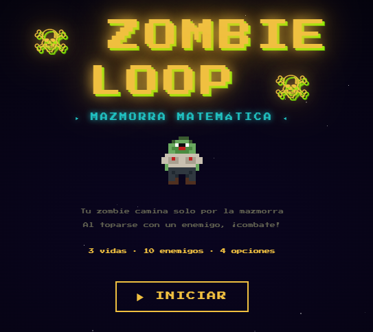
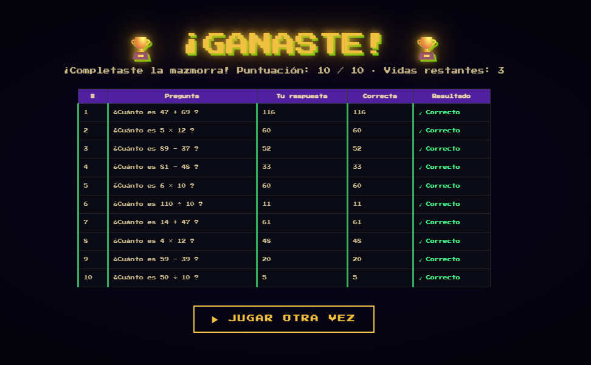
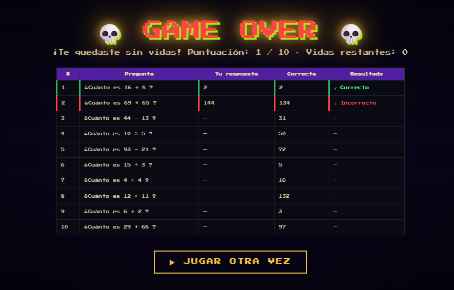

# 🧟 Zombie-Loop

<p align="center">
  
</p>

<h1 align="center">🧟 ZOMBIE-LOOP</h1>

<p align="center">
  <strong>¡Resuelve, sobrevive y atraviesa la mazmorra!</strong>
</p>

<p align="center">
  🎮 <strong>2D Pixel Art</strong> · 🧮 <strong>Matemática</strong> · 👾 <strong>Aventura</strong>
</p>

---

## 🎮 ¿De qué trata?

**Zombie-Loop** es un videojuego educativo en **2D Pixel Art** diseñado para niños que están entrando a la secundaria.

El jugador controla a un zombie que avanza automáticamente por una mazmorra llena de monstruos. Para derrotarlos, deberá demostrar sus conocimientos matemáticos resolviendo operaciones de:

* ➕ Suma
* ➖ Resta
* ✖️ Multiplicación
* ➗ División

Cada monstruo presenta una pregunta con **4 posibles respuestas**. Solo una es correcta.

---

## 🎯 Objetivo

El objetivo es atravesar toda la mazmorra y derrotar a los **10 enemigos**.

Cada respuesta correcta permite eliminar al monstruo y continuar avanzando.

Si el jugador responde incorrectamente, pierde parte de su barra de vida.

> ❤️ **¡No dejes que la vida llegue a 0!**

---

## ⚙️ Mecánica principal

La mecánica principal combina **aventura y preguntas matemáticas**.

El zombie avanza automáticamente y el jugador debe concentrarse en las preguntas que aparecen durante el recorrido.

```text
👾 Enemigo
   ↓
🧮 Pregunta matemática
   ↓
🔢 4 respuestas
   ↓
┌───────────────┐
│ ✅ Correcta   │ → Derrota al enemigo
│ ❌ Incorrecta │ → Pierdes vida
└───────────────┘
```

El jugador debe derrotar a los **10 monstruos** para completar el recorrido.

---

## 🕹️ Controles

| Acción           | Control    |
| ---------------- | ---------- |
| Elegir respuesta | 🖱️ CLICK  |
| Movimiento       | Automático |

**No es necesario utilizar WASD ni otros controles de movimiento.**

El jugador únicamente debe hacer **click sobre la respuesta que considere correcta**.

---

## 🏆 Victoria

El jugador gana cuando:

> 🧟 **Derrota a los 10 enemigos de la mazmorra.**

<p align="center">
  
</p>

---

## 💀 Derrota

Si el jugador responde incorrectamente demasiadas preguntas y su barra de vida llega a **0**, la partida termina.

<p align="center">
  
</p>

---

## 📸 Gameplay

<p align="center">
  
</p>

---

## 🎭 Género

### 🗺️ Adventure · 🧩 Puzzle · 🎓 Educational

Aunque el juego tiene una estructura de aventura, su mecánica principal está basada en la resolución de **puzles matemáticos**.

---

## ▶️ Jugar

<p align="center">

<a href="https://ivoismael.github.io/GameDevelopmentPortafolio/Zombie-Loop/">
  <strong>🎮 JUGAR ZOMBIE-LOOP</strong>
</a>

</p>

---

## 💡 Propósito educativo

Zombie-Loop busca convertir la práctica de operaciones matemáticas básicas en una experiencia interactiva.

La presión de avanzar por una mazmorra y enfrentarse a enemigos convierte cada operación en un pequeño desafío.

> 🧠 **Aprender también puede ser una aventura.**

---

<p align="center">
  🧟 <strong>10 enemigos.</strong> 🧮 <strong>4 operaciones.</strong> ❤️ <strong>Una sola barra de vida.</strong>
</p>
